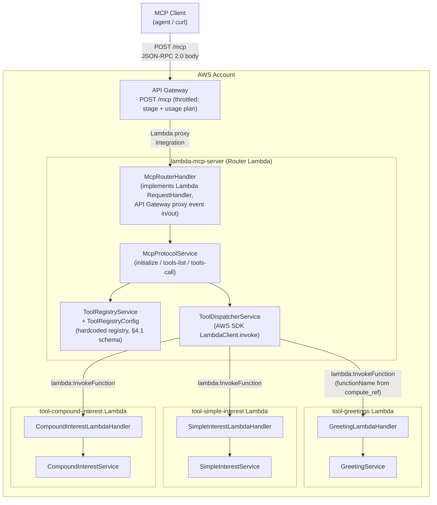
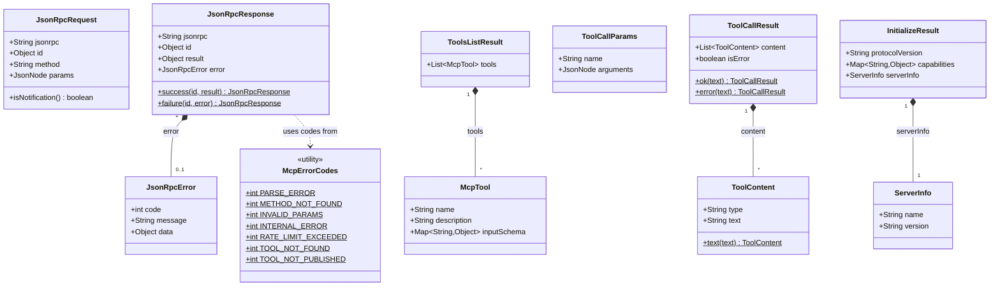
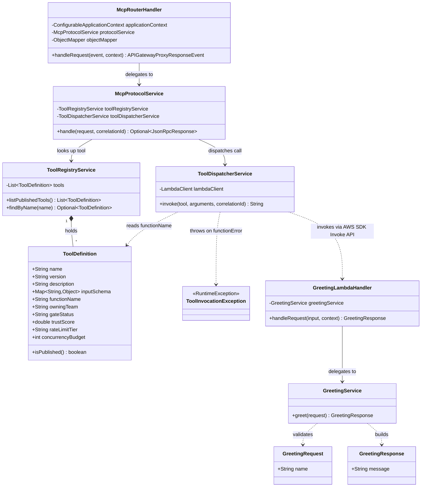
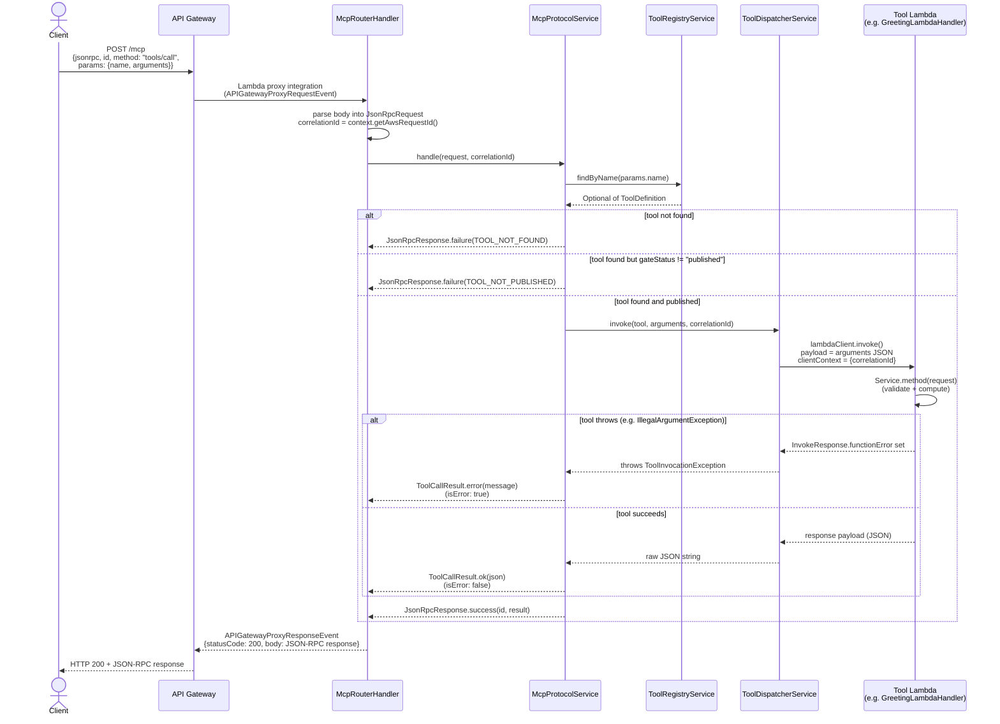
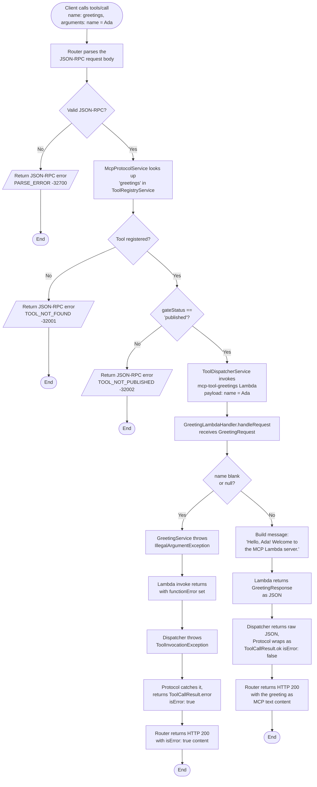

# lambda-mcp-server

A sample **Model Context Protocol (MCP)** server hosted on **AWS Lambda**, fronted by
**API Gateway** for throttling, built in **Java** with **Spring**. It follows the
AWS Lambda track of the org's *MCP Server & Tool Hosting Blueprint* (dual-runtime
reference architecture; this project implements the Lambda side only).

Four Lambda functions, one API Gateway route:

```
                                   ┌─────────────────────────────┐
   MCP Client                     │        API Gateway           │
  (Claude, agent, curl) ───POST──▶│  POST /mcp  (throttled here) │
                                   └───────────────┬──────────────┘
                                                    │ Lambda proxy integration
                                                    ▼
                                   ┌─────────────────────────────┐
                                   │   lambda-mcp-server (router)  │
                                   │  Spring Boot, non-web context │
                                   │  - parses JSON-RPC envelope   │
                                   │  - looks up tool in registry  │
                                   │  - refuses unpublished tools  │
                                   │  - dispatches tools/call      │
                                   └───┬─────────┬─────────┬──────┘
                       lambda:Invoke   │         │         │
                     ┌─────────────────┘         │         └─────────────────┐
                     ▼                            ▼                           ▼
           ┌───────────────────┐      ┌────────────────────────┐  ┌─────────────────────────┐
           │  tool-greetings    │      │  tool-simple-interest   │  │  tool-compound-interest  │
           │  plain Spring DI,  │      │  plain Spring DI,       │  │  plain Spring DI,        │
           │  no web/autoconfig │      │  no web/autoconfig      │  │  no web/autoconfig       │
           └───────────────────┘      └────────────────────────┘  └─────────────────────────┘
```

Each tool is its own Lambda function, independently deployable and scalable, exactly as
Blueprint Section 3 describes ("Per-Tool Compute Unit — one Lambda function ... per
tool"). The router is the only component that knows the JSON-RPC/MCP protocol; tools
know nothing about MCP at all — they just receive their own typed JSON input and return
their own typed JSON output.

## Project structure

```
lambda-mcp-server/
├── pom.xml                       parent (Maven multi-module)
├── common/                       JSON-RPC 2.0 + MCP model classes (router-only; no Spring/AWS deps)
├── router/                       the lambda-mcp-server function
│   └── .../router/
│       ├── McpRouterHandler.java       Lambda entry point (API Gateway proxy event in/out)
│       ├── RouterApplication.java      @SpringBootApplication, non-web
│       ├── config/                     ToolRegistryConfig (hardcoded registry), AwsClientConfig, JacksonConfig
│       ├── registry/                   ToolDefinition, ToolRegistryService
│       ├── protocol/                   McpProtocolService (initialize / tools/list / tools/call)
│       └── dispatch/                   ToolDispatcherService (invokes the target tool Lambda)
├── tool-greetings/                the "greetings" tool Lambda
├── tool-simple-interest/          the "simple-interest-calculator" tool Lambda
└── tool-compound-interest/        the "compound-interest-calculator" tool Lambda
```

## Architecture Diagrams

Diagrams below are drawn directly from the actual class/method names in this repo (not
a stylized approximation) so they stay a reliable map of the code, not just the concept.
GitHub renders all of these natively from the Mermaid fences.

### Component diagram

Container/component view in the C4 sense used throughout this README: the deployable
units and how they talk to each other. `McpRouterHandler`, `McpProtocolService`,
`ToolRegistryService`, and `ToolDispatcherService` are the components *inside* the
router container (Blueprint §4.3); each tool Lambda is its own container, invoked only
by the router.



### Class diagram

Split into two diagrams for readability: the shared JSON-RPC/MCP protocol contract
(`common` module, used only by the router), and the router's own internals plus one
tool module as an exemplar.

**Common protocol & model classes** (`common` module):



**Router internals + exemplar tool module** (`tool-greetings` shown; `tool-simple-interest`
and `tool-compound-interest` mirror this exact Handler → Service → Request/Response
shape, just with different calculation logic):



### Sequence diagram: `tools/call` (any tool)

The general request path every tool call takes, end to end - this is what the router
does regardless of which of the three tools is named in `params.name`.



### Activity diagram: calling the `greetings` tool

A concrete walk through the sequence diagram above for the simplest possible case -
a client invoking `tools/call` for `greetings` - including the two validation branches
that actually exist in the code: the registry gate check in `McpProtocolService`, and
the blank-name check in `GreetingService.greet()`.



## Design decisions (and where this sample deliberately diverges from the Blueprint)

These were confirmed up front rather than assumed:

| Decision | Chosen | Blueprint says | Why the divergence is OK here |
|---|---|---|---|
| Tool Lambda framework | Plain Spring DI (`spring-context`), **no** `spring-boot-starter-web`/autoconfiguration | Booting a full Spring `ApplicationContext` in a single-purpose tool Lambda is an explicit anti-pattern (§5.1) | You asked for Spring Boot constructs generally; this keeps genuine Spring `@Component`/`@Service`/DI in every tool while staying off the autoconfiguration/classpath-scanning machinery the Blueprint specifically warns about. The **router** does use full `spring-boot-starter` (non-web) — it's the one container complex enough (§4.3) to justify it. |
| Tool registry | Hardcoded in `ToolRegistryConfig` (a Spring `@Bean` list) | Data-driven registry, DynamoDB-backed, so tools onboard without a router redeploy (§4.1) | For a fixed 3-tool sample, a DynamoDB table buys nothing but another resource to provision/seed. The registry record shape (name, version, description, `compute_ref`, `owningTeam`, `gateStatus`, `trustScore`, `rateLimitTier`, `concurrencyBudget`) mirrors §4.1 field-for-field, and `ToolRegistryService`'s public contract is exactly what you'd keep if you later swapped the config class for a DynamoDB-backed implementation. |
| Infrastructure | No IaC. Java/Spring source only; this README documents manual AWS CLI/console steps | Not addressed by the Blueprint (out of scope there too) | Explicit choice — deploy manually, wire up SAM/CDK/Terraform later if/when this graduates past a sample. |
| Rate limiting | **API Gateway only** (stage/usage-plan throttling — the "global axis", §8.3) | Two-layer enforcement: gateway (coarse) **and** router (authoritative, per-tool/per-consumer, backed by a distributed counter store) (§8.5) | The Blueprint is explicit that plain API Gateway usage plans are "sufficient for the global axis, insufficient alone for the per-tool axis, since every tool call shares one route" (§8.3) — true here too: `/mcp` is a single route for all three tools. Router-level per-tool/per-consumer accounting, the `-32000` throttle error contract, and fail-open/fail-closed per tier (§9.1) are **not implemented** — see "Known limitations" below. `McpErrorCodes.RATE_LIMIT_EXCEEDED` is defined and unused, deliberately, as the slot a future limiter would fill. |

## Prerequisites

- Java 21
- Maven 3.9+
- An AWS account with permissions to create Lambda functions, IAM roles, and an API
  Gateway REST API (for the deploy steps)
- AWS CLI v2 (for the deploy steps) and `jq` (optional, for pretty-printing test responses)

## Framework version

Built on **Spring Boot 4.1.0** (Spring Framework 7.0.8). Note: Spring Boot **4.1.1**
does not exist on Maven Central as of this writing - verified directly against
`repo.maven.apache.org` rather than assumed. 4.1.0 (released 2026-06-10) is the latest
4.1.x release; bump `spring-boot.version` in the parent `pom.xml` if/when 4.1.1 ships.

This upgrade (from the previous 3.3.5 baseline) required **no application code changes**.
Spring Boot 4's headline breaking change - the switch to Jackson 3 (`tools.jackson.*`)
as the default JSON library - only affects apps that rely on Boot's autoconfigured
`ObjectMapper`/`JsonMapper` bean, typically via `spring-boot-starter-web`. This project
never did either: the tool Lambdas deliberately skip `spring-boot-starter-web`
entirely (see the design decisions table above), and the router defines its own
Jackson 2 `ObjectMapper` bean explicitly (`JacksonConfig`) rather than relying on
autoconfiguration - which was already necessary under 3.3.5, since Boot's Jackson
autoconfiguration itself requires `spring-web` on the classpath. Verified empirically:
Spring Boot 4.1.0's own BOM still manages the classic `com.fasterxml.jackson.core:jackson-databind`
(Jackson 2) coordinates at 2.21.4, and `spring-boot-starter` (the non-web starter every
module here uses) does not pull Jackson 3 in transitively at all.

## Build

```bash
mvn clean verify
```

This compiles all five modules, runs unit tests (business logic + protocol dispatch +
a Spring context boot test for the router), and shades each module into a single
deployable jar via `maven-shade-plugin` — **not** `spring-boot-maven-plugin:repackage**.
The Lambda Java runtime loads the handler class straight off the classpath; Spring
Boot's nested-jar layout needs a custom `JarLauncher`/classloader that the standard
Lambda runtime doesn't provide, so every module (router included) shades into a flat
uber-jar instead.

Build artifacts:

| Module | Jar | Handler |
|---|---|---|
| router | `router/target/router.jar` (~20 MB) | `com.milind.mcp.router.McpRouterHandler::handleRequest` |
| tool-greetings | `tool-greetings/target/tool-greetings.jar` (~7 MB) | `com.milind.mcp.tools.greetings.GreetingLambdaHandler::handleRequest` |
| tool-simple-interest | `tool-simple-interest/target/tool-simple-interest.jar` (~7 MB) | `com.milind.mcp.tools.simpleinterest.SimpleInterestLambdaHandler::handleRequest` |
| tool-compound-interest | `tool-compound-interest/target/tool-compound-interest.jar` (~7 MB) | `com.milind.mcp.tools.compoundinterest.CompoundInterestLambdaHandler::handleRequest` |

All comfortably under Lambda's 50 MB zip direct-upload limit (Blueprint §5.1).

## Deploying to AWS

All commands assume `bash`, AWS CLI v2 configured with credentials, and these
variables set:

```bash
export AWS_REGION=us-east-1                      # pick your region
export ACCOUNT_ID=$(aws sts get-caller-identity --query Account --output text)
```

### 1. Create IAM roles

**Tool execution role** — least-privilege, just CloudWatch Logs (Blueprint §10.1: "Each
tool Lambda runs under its own least-privilege execution role, scoped to exactly what
that tool needs" — all three tools here only need logs, so one shared role is fine; give
each its own role if a future tool needs to reach other AWS services):

```bash
cat > /tmp/lambda-trust-policy.json <<'EOF'
{
  "Version": "2012-10-17",
  "Statement": [{
    "Effect": "Allow",
    "Principal": { "Service": "lambda.amazonaws.com" },
    "Action": "sts:AssumeRole"
  }]
}
EOF

aws iam create-role \
  --role-name mcp-tool-execution-role \
  --assume-role-policy-document file:///tmp/lambda-trust-policy.json

aws iam attach-role-policy \
  --role-name mcp-tool-execution-role \
  --policy-arn arn:aws:iam::aws:policy/service-role/AWSLambdaBasicExecutionRole
```

**Router execution role** — logs, plus `lambda:InvokeFunction` scoped to exactly the
three tool functions (Blueprint §10.1: "the router holds invoke-only permission on tool
Lambdas and no direct access to the AWS services those tools reach — the model can only
ever go through the router"):

```bash
aws iam create-role \
  --role-name mcp-router-execution-role \
  --assume-role-policy-document file:///tmp/lambda-trust-policy.json

aws iam attach-role-policy \
  --role-name mcp-router-execution-role \
  --policy-arn arn:aws:iam::aws:policy/service-role/AWSLambdaBasicExecutionRole

cat > /tmp/router-invoke-policy.json <<EOF
{
  "Version": "2012-10-17",
  "Statement": [{
    "Effect": "Allow",
    "Action": "lambda:InvokeFunction",
    "Resource": [
      "arn:aws:lambda:${AWS_REGION}:${ACCOUNT_ID}:function:mcp-tool-greetings",
      "arn:aws:lambda:${AWS_REGION}:${ACCOUNT_ID}:function:mcp-tool-simple-interest",
      "arn:aws:lambda:${AWS_REGION}:${ACCOUNT_ID}:function:mcp-tool-compound-interest"
    ]
  }]
}
EOF

aws iam put-role-policy \
  --role-name mcp-router-execution-role \
  --policy-name invoke-mcp-tool-lambdas \
  --policy-document file:///tmp/router-invoke-policy.json

# Role propagation takes a few seconds
sleep 10
```

### 2. Create the three tool Lambda functions

```bash
aws lambda create-function \
  --function-name mcp-tool-greetings \
  --runtime java21 \
  --handler com.milind.mcp.tools.greetings.GreetingLambdaHandler::handleRequest \
  --role arn:aws:iam::${ACCOUNT_ID}:role/mcp-tool-execution-role \
  --zip-file fileb://tool-greetings/target/tool-greetings.jar \
  --timeout 15 \
  --memory-size 512

aws lambda create-function \
  --function-name mcp-tool-simple-interest \
  --runtime java21 \
  --handler com.milind.mcp.tools.simpleinterest.SimpleInterestLambdaHandler::handleRequest \
  --role arn:aws:iam::${ACCOUNT_ID}:role/mcp-tool-execution-role \
  --zip-file fileb://tool-simple-interest/target/tool-simple-interest.jar \
  --timeout 15 \
  --memory-size 512

aws lambda create-function \
  --function-name mcp-tool-compound-interest \
  --runtime java21 \
  --handler com.milind.mcp.tools.compoundinterest.CompoundInterestLambdaHandler::handleRequest \
  --role arn:aws:iam::${ACCOUNT_ID}:role/mcp-tool-execution-role \
  --zip-file fileb://tool-compound-interest/target/tool-compound-interest.jar \
  --timeout 15 \
  --memory-size 512
```

### 3. Create the router Lambda function

The `*_FUNCTION_NAME` environment variables are how the router's registry resolves
each tool's `compute_ref` (see `ToolRegistryConfig`) — they default to the names used
above, but are set explicitly here so the router isn't relying on defaults matching
what you deployed.

The `--timeout 29` intentionally matches API Gateway's default 29-second integration
timeout (Blueprint §6: "it introduces its own, independent timeout ceiling on top of
Lambda's own limit, and it's a common source of confusion when the two don't match").

```bash
aws lambda create-function \
  --function-name mcp-router \
  --runtime java21 \
  --handler com.milind.mcp.router.McpRouterHandler::handleRequest \
  --role arn:aws:iam::${ACCOUNT_ID}:role/mcp-router-execution-role \
  --zip-file fileb://router/target/router.jar \
  --timeout 29 \
  --memory-size 768 \
  --environment "Variables={GREETINGS_FUNCTION_NAME=mcp-tool-greetings,SIMPLE_INTEREST_FUNCTION_NAME=mcp-tool-simple-interest,COMPOUND_INTEREST_FUNCTION_NAME=mcp-tool-compound-interest}"
```

### 4. Create the API Gateway REST API

A single resource, `/mcp`, with one `POST` method proxying to the router — matching
Blueprint §8.1's point that MCP multiplexes every JSON-RPC method through one route.

```bash
API_ID=$(aws apigateway create-rest-api \
  --name mcp-server-api \
  --endpoint-configuration types=REGIONAL \
  --query 'id' --output text)

PARENT_ID=$(aws apigateway get-resources \
  --rest-api-id "$API_ID" \
  --query 'items[0].id' --output text)

RESOURCE_ID=$(aws apigateway create-resource \
  --rest-api-id "$API_ID" \
  --parent-id "$PARENT_ID" \
  --path-part mcp \
  --query 'id' --output text)

aws apigateway put-method \
  --rest-api-id "$API_ID" \
  --resource-id "$RESOURCE_ID" \
  --http-method POST \
  --authorization-type NONE

aws apigateway put-integration \
  --rest-api-id "$API_ID" \
  --resource-id "$RESOURCE_ID" \
  --http-method POST \
  --type AWS_PROXY \
  --integration-http-method POST \
  --uri "arn:aws:apigateway:${AWS_REGION}:lambda:path/2015-03-31/functions/arn:aws:lambda:${AWS_REGION}:${ACCOUNT_ID}:function:mcp-router/invocations"

aws lambda add-permission \
  --function-name mcp-router \
  --statement-id apigateway-invoke-mcp-router \
  --action lambda:InvokeFunction \
  --principal apigateway.amazonaws.com \
  --source-arn "arn:aws:execute-api:${AWS_REGION}:${ACCOUNT_ID}:${API_ID}/*/POST/mcp"

aws apigateway create-deployment \
  --rest-api-id "$API_ID" \
  --stage-name prod
```

### 5. Configure throttling on the stage

This is the "API Gateway for throttling" piece — stage-level rate/burst limits apply
across the whole `/mcp` route (the global axis, Blueprint §8.2/8.3):

```bash
aws apigateway update-stage \
  --rest-api-id "$API_ID" \
  --stage-name prod \
  --patch-operations \
      op=replace,path=/*/throttling/rateLimit,value=50 \
      op=replace,path=/*/throttling/burstLimit,value=100
```

**Optional — usage plan + API key**, for a stricter or per-consumer-flavored limit
(still global-axis; a usage plan can't see inside the JSON-RPC body to key on tool
name, per Blueprint §8.3):

```bash
# Require an API key on the method first
aws apigateway update-method \
  --rest-api-id "$API_ID" \
  --resource-id "$RESOURCE_ID" \
  --http-method POST \
  --patch-operations op=replace,path=/apiKeyRequired,value=true

aws apigateway create-deployment --rest-api-id "$API_ID" --stage-name prod

USAGE_PLAN_ID=$(aws apigateway create-usage-plan \
  --name mcp-server-usage-plan \
  --throttle burstLimit=20,rateLimit=10 \
  --quota limit=10000,period=MONTH \
  --api-stages apiId="$API_ID",stage=prod \
  --query 'id' --output text)

API_KEY_ID=$(aws apigateway create-api-key \
  --name mcp-server-sample-key --enabled \
  --query 'id' --output text)

aws apigateway create-usage-plan-key \
  --usage-plan-id "$USAGE_PLAN_ID" \
  --key-id "$API_KEY_ID" \
  --key-type API_KEY

API_KEY_VALUE=$(aws apigateway get-api-key --api-key "$API_KEY_ID" --include-value --query 'value' --output text)
```

If you enable the API key, add `-H "x-api-key: $API_KEY_VALUE"` to the `curl` calls below.

### 6. (Optional) Enable SnapStart on the tool functions

Blueprint §5.1's default recommendation — free, and eliminates most of the Java cold
start once you've already avoided the "heavy `ApplicationContext` in a tool Lambda"
anti-pattern (which this project does). SnapStart requires invoking a **published
version or alias**, not `$LATEST`:

```bash
for FN in mcp-tool-greetings mcp-tool-simple-interest mcp-tool-compound-interest; do
  aws lambda update-function-configuration --function-name "$FN" \
    --snap-start ApplyOn=PublishedVersions
  aws lambda wait function-updated --function-name "$FN"
  VERSION=$(aws lambda publish-version --function-name "$FN" --query 'Version' --output text)
  aws lambda create-alias --function-name "$FN" --name live --function-version "$VERSION"
done
```

If you do this, update the router's `*_FUNCTION_NAME` environment variables to include
`:live` (e.g. `mcp-tool-greetings:live`) so it invokes the alias, then re-publish a new
alias version after every future deploy of that tool.

## Testing the deployed server

```bash
INVOKE_URL="https://${API_ID}.execute-api.${AWS_REGION}.amazonaws.com/prod/mcp"

# 1. initialize
curl -s -X POST "$INVOKE_URL" -H "Content-Type: application/json" \
  -d '{"jsonrpc":"2.0","id":1,"method":"initialize","params":{"protocolVersion":"2024-11-05"}}' | jq

# 2. tools/list
curl -s -X POST "$INVOKE_URL" -H "Content-Type: application/json" \
  -d '{"jsonrpc":"2.0","id":2,"method":"tools/list"}' | jq

# 3. tools/call - greetings
curl -s -X POST "$INVOKE_URL" -H "Content-Type: application/json" \
  -d '{"jsonrpc":"2.0","id":3,"method":"tools/call","params":{"name":"greetings","arguments":{"name":"Ada"}}}' | jq

# 4. tools/call - simple-interest-calculator
curl -s -X POST "$INVOKE_URL" -H "Content-Type: application/json" \
  -d '{"jsonrpc":"2.0","id":4,"method":"tools/call","params":{"name":"simple-interest-calculator","arguments":{"principal":1000,"rateOfInterest":5,"timeInYears":2}}}' | jq

# 5. tools/call - compound-interest-calculator
curl -s -X POST "$INVOKE_URL" -H "Content-Type: application/json" \
  -d '{"jsonrpc":"2.0","id":5,"method":"tools/call","params":{"name":"compound-interest-calculator","arguments":{"principal":1000,"rateOfInterest":8,"timeInYears":1,"compoundingFrequency":"QUARTERLY"}}}' | jq
```

Expected `tools/call` response shape (result content is the tool's raw JSON, returned
as an MCP text content block):

```json
{
  "jsonrpc": "2.0",
  "id": 3,
  "result": {
    "content": [
      { "type": "text", "text": "{\"message\":\"Hello, Ada! Welcome to the MCP Lambda server.\"}" }
    ],
    "isError": false
  }
}
```

To see throttling in action, exceed the configured `rateLimit`/`burstLimit` (e.g. loop
the `curl` call quickly) — API Gateway returns a plain HTTP `429` with no JSON-RPC body,
since the router never sees the request. This is exactly the gap Blueprint §8.1
describes ("the first sign of trouble being an opaque 429 with no machine-readable
backoff signal") and is a direct consequence of enforcing only at the gateway layer —
see "Known limitations" below.

## Local build verification (no AWS required)

```bash
mvn clean verify
```

Runs all unit tests: tool calculation logic (`SimpleInterestServiceTest`,
`CompoundInterestServiceTest`, `GreetingServiceTest`), the router's JSON-RPC dispatch
logic against mocked collaborators (`McpProtocolServiceTest`), the registry
(`ToolRegistryServiceTest`), and a real Spring context boot (`RouterApplicationContextTest`)
that catches DI wiring mistakes the mocked tests can't see.

## Known limitations (intentional, for this sample)

Called out explicitly rather than silently omitted, each traceable to a Blueprint section:

- **No DynamoDB-backed registry** (§4.1) — tools are hardcoded in `ToolRegistryConfig`.
  Onboarding a fourth tool means a router code change + redeploy, not a registry row insert.
- **No router-level rate limiting** (§8.3-8.5) — only API Gateway's global-axis throttling
  is implemented. Per-tool and per-consumer accounting, the `-32000` JSON-RPC error with
  `limit`/`window`/`retryAfter`, and a distributed counter store (DynamoDB atomic counters
  or Redis) are not built. `McpErrorCodes.RATE_LIMIT_EXCEEDED` exists as the reserved slot.
- **No fail-open/fail-closed policy** (§9.1) — moot without a counter store to fail from,
  but flagged here because the Blueprint treats this as a decision needing explicit
  sign-off, not a default.
- **No X-Ray tracing** (§11) — correlation ID propagation exists (router's Lambda request
  ID flows to each tool via `ClientContext`, both sides log it), but there's no distributed
  trace stitching it together in the console.
- **`resources/*` not implemented** — this server only hosts tools; any `resources/*`
  call returns a standard JSON-RPC `METHOD_NOT_FOUND`.
- **No IaC** — deployment above is manual AWS CLI. No SAM/CDK/Terraform template is
  included, per explicit request.
